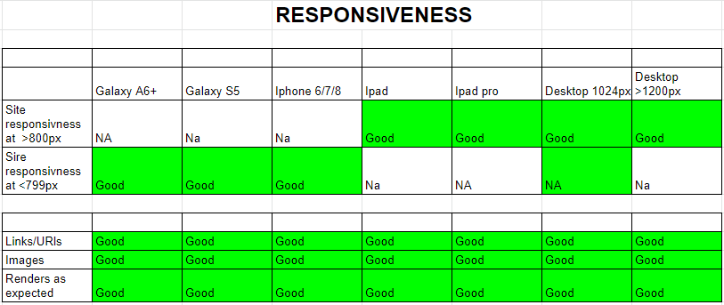

<h1  align="center">

</h1>

PCGamer Collect 

  

This Project is for milestone 4 full stack web development 

 

  

## Table of Contents

1.  [**UX**](#ux)
-  [**Project Goals**](#project-goals)
-  [**User goals**](#user-goals)
-  [**User Stories**](#user-stories)
-  [**Design**](#design)
-  [**Wireframes**](#wireframes)

  
2.  [**Features**](#features)
-  [**Existing Features**](#existing-features)
-  [**Features Left to Implement**](#features-left-to-implement)
3.  [**Database**](#database)
4.  [**Technologies used**](#technologies-used)
5.  [**Testing**](#testing)
6.  [**Deployment**](#deployment)
7.  [**Acknowledgements**](#acknowledgements)
8.  [**Disclaimer**](#disclaimer)

  
## UX

  

### Project Goals

  
The goal of this project is to utilise what i have learnt to create a fullstack website thats goal is to create 
a place where the user can order and get delivered physical boxed games to build their shelf or hobby room collection 
  

#### User goals
User goals in brief are as follows:

 1. To have a wide array of gamse to choose from
 2. To be able to create an account and add address and details
 3. to see a review out of 10
 4. To be able to add multiple items to the basket 
 5. To have a basket to see items you wish to purchase
 6. To be able to search for games by genres 
 7. To have a the ability to search via price/rating/name

  

#### User Stories

1. I want to see game summarys when i go to the games page.
2. I want the UI to be simple and easy to understand
3. The games should have descriptions.
4. The games should have a score.
5. I can add more than one item to my basket.
6. To be able to make an account and log in and out.
7. To be able to customise the search options.
8. I would like to be able search for specific titles.
9. I would like to be able to log in easily when details are correct.
10. I want the abilty to view my profile .
11. There should be options to register and login on the site navigation,
12. If im logged in i should see navigation options to log out, and view my profile.

  

### Design

  
**Fonts**

Used the font Lato for a proifessional and clean look

**Colours**

Went with a white base colour to keep everything looking clean and allow images to pop out and black to give a nice contrasting look 

**Topography**

The site uses bootstrap 4 be responsive across devices, also media queries were used to change how the intro text appears across different devices to provide a smooth user experience.

### Wireframes

WireFrames were created using Figma at recomendation of my tutor. https://www.figma.com/  
they can be found here [wireframes(media/Wireframes)] 
The original design that was chosen was too similar to the Boutique ado project and while i am very fond of the simple design things where changed to make it stand out and look different 

  

## Features

### Existing Features

1. Users can view use a veriaty of search function to look for a game .
2. Users can create and account and use to to record purchase history .
3. Users can log in and out at will.
4. Users can see what the score of the games are .
5. Users can add mutiple items to their basket.
6. Users can remove items from basket.
7. Users can saftly make transactions 

### Future Features to Implement

Future versions of the project may have the following:

1. Ability to reset an account password.
2. Ability to leave personal reviews on products.
3. More items like statues and other hobby items.
4. multiple tags per games that have multiple.

 

## Database

Amazon AWS used to store media 

## Technologies Used

  

This project uses Python,HTML, CSS and JavaScript technologies.

  

-  [Python](https://www.python.org/)
The project uses **Python 3** to create the app, create the routes, create the functions within those routes and handles all back end interactions.

- [JQuery](https://jquery.com)
 The project uses **JQuery** as part of bootstrap 4 and to create a character counter on the text area fields.

-  [Bootstrap 4](https://getbootstrap.com/)
The project uses **Bootstrap** to simplify the structure of the website and make the website responsive easily.

-  **HTML 5 and CSS3**
The project uses **HTML5 and CSS3** for website structure and design.

-  [Google Fonts](https://fonts.google.com/)
The project used the **Google 'Ubuntu' font** across the site

-  [GitHub](https://github.com/)
This project uses **GitHub** to remotely store the source code in a repository. The project can be cloned or downloaded from here. See [Deployment](#deployment) section

-  [StackEdit](https://stackedit.io)
This project uses **StackEdit** to build the markdown for this readme file

 
  
  

## Testing

  

Testing was done incrementaly and influnced the end result of the project.

  
I tested the python code with https://extendsclass.com/python-tester.html and came back with no syntax errors 
CCS was tested with https://jigsaw.w3.org/css-validator/ there where 2 warnings but i have chosen to ignore these as they cause no problems
the html validator https://validator.w3.org/ showed up multiple errors as the techincque to create templates was casuing flags these where ignored.

  

When the project was fully completed i went through the below testing scenarios to further test the project to make sure that it reached my goal.

Main problems that where run into was a server error 500 upon making an account the issue was happening when the change to the 
verification page the accounts where being created with no verification needed and it was causing a server 500 error with no email being sent, after pinpointing the location of the problem the issue turned out to be a simple synatax error that has gotten lost in the code after fixing that the problem was solved and it worked as intended 

Testing Steps:

Checking the email and verification system, using temp mail i made many account testing and retesting all of the log out and account creation functions at each stage of development i would create an account and check that everything was working as intended 

Testing Useabliltiy' on multiple devices using the google developer tools i used all of the features on the site to make sure everything was working as intended 

## Deployment

I personally used vscode on my local machine to develop the site using Python 3.7.3  and deployed to Heroku via Github.

1. To download or clone the site to your local machine you will need to go to (https://github.com/OriHillairetdev/trend_setter) see steps in https://help.github.com/en/articles/cloning-a-repository .
2. Before you download or clone the site you will need to ensure you have [Python 3.7](https://www.python.org/downloads/) installed. 
3. Once you have Python installed, created a virtual environment as appropriate to you chosen IDE and os.
4. Run the requirements.txt file as appropriate to your IDE to install the relevant required packages dependencies for the project into your virtual environment.
5. Run the app.py file as appropriate to your chosen environment and os.
6. You should now be able to view the site on your localhost on port 5000.

### Acknowledgements

Stack overflow and student help  
  

#### Disclaimer

The content of this website is educational purposes only  